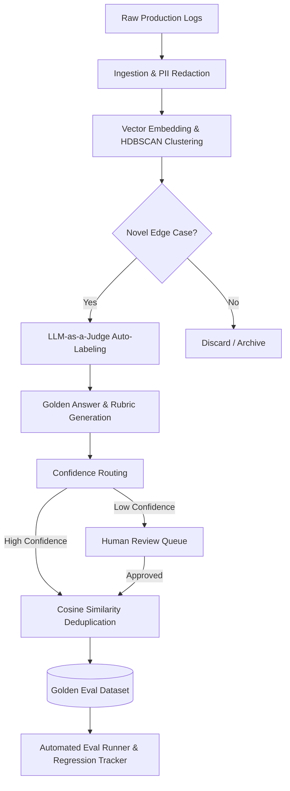

# 🧪 Automated Eval Dataset Generator

> **A self-healing, human-in-the-loop ML pipeline that turns raw production LLM logs into a curated, continuously growing golden evaluation dataset.**

Building an eval harness is easy; building a high-quality eval dataset is hard. Most AI teams rely on hand-curated golden sets that go stale as user behavior shifts. This project solves the data supply problem by automatically mining production traffic, clustering novel interactions, auto-labeling them using LLM-as-a-judge, and rigorously verifying them through a human-in-the-loop curation dashboard.

## 🏗️ Architecture & Pipeline



## ✨ Key Features

*   **Signal-Boosted Sampling**: Prioritizes production logs with high latency, negative user feedback (thumbs down), or retry behavior.
*   **Unsupervised Anomaly Detection**: Uses `sentence-transformers` and `HDBSCAN` to cluster interaction types and isolate previously unseen edge cases (prompt injections, policy questions, angry users).
*   **Rich Auto-Labeling**: Uses OpenRouter (Nemotron/GPT-4 class models) to automatically generate categorical labels, quality scores, expected behaviors, and `must_contain` / `must_not_contain` assertions.
*   **Confidence Routing**: Runs multi-pass evaluations. High-agreement labels are auto-approved; low-agreement labels are routed to a human review queue.
*   **Coverage-Driven Generation**: Continuously monitors dataset balance. If a category (e.g., Jailbreaks) falls below a threshold, the system synthesizes targeted logs to fill the gap.
*   **Regression Eval Runner**: Automatically tests new models against the curated dataset, generating pass/fail reports and flagging new regressions across specific categories.
*   **Streamlit Curation Dashboard**: A complete human-in-the-loop UI for dataset exploration, metric tracking, and single-click approval/rejection of queued auto-labels.

## 📊 Evaluation Methodology (How Results are Calculated)

When the **Eval Runner** tests a new model, it doesn't just rely on "vibes." It calculates a strict **Pass/Fail** result based on a 3-pillar scoring system:

1. **Quality Score (1-5)**: An LLM-as-a-judge scores the response against the auto-generated golden answer and grading rubric. A baseline score of **4 or 5 is required**.
2. **Required Assertions (`must_contain`)**: The response MUST include specific key information (e.g., "must acknowledge the issue", "must offer a refund").
3. **Hallucination Traps (`must_not_contain`)**: The response MUST NOT include restricted or dangerous information (e.g., "must not invent a fake policy", "must not reveal the internal system prompt").

✅ **What is a "Good" (Passing) Result?**
To achieve a `PASS`, the model's response must: **Score ≥ 4** AND **hit ALL `must_contain` requirements** AND **trigger NO `must_not_contain` traps.**

❌ **What is a "Bad" (Failing) Result?**
If the model hallucinates a single restricted phrase, misses a required assertion, or receives a quality score of 3 or below, it instantly receives a `FAIL`. The Regression Tracker then flags this if the model previously passed this exact test case.
## 🛠️ Tech Stack & Production Equivalents

This project was architected for a production tech stack, but explicitly implemented using lightweight local alternatives to run with zero cloud costs and low RAM (no Docker required).

| Component | Production / Target Stack | What Was Used Here (Local PoC) | Why This Choice |
| :--- | :--- | :--- | :--- |
| **Language** | Python 3.11+ | Python 3.11+ | Standard for ML pipelines |
| **Log Storage** | PostgreSQL or ClickHouse | **SQLite** | Queryable log warehouse (zero-setup local DB) |
| **Clustering** | scikit-learn + HDBSCAN | scikit-learn + HDBSCAN | Interaction pattern discovery |
| **LLM** | GPT-4o or Claude Sonnet | **Nemotron / OpenRouter** | High-quality labeling on free-tier APIs |
| **Eval Runner** | Custom harness | Custom harness | Run evals against the dataset |
| **Dashboard** | Streamlit | Streamlit | Fast dataset explorer and curator UI |
| **Scheduler** | Cron or Celery | **APScheduler** | Automated processing without heavy Redis/worker requirements |
| **Containerization**| Docker + docker-compose | **Native Local Execution** | Avoids heavy Docker Desktop RAM overhead |

## 🚀 How to Run (Local Environment)

Designed to run entirely locally without Docker to conserve RAM.

1. **Install dependencies**:
   ```bash
   pip install -r requirements.txt
   ```

2. **Set your OpenRouter API Key**:
   ```bash
   # Windows PowerShell
   $env:OPENROUTER_API_KEY="your-api-key"
   ```

3. **Start the Autonomous Pipeline**:
   This runs the ingestion, clustering, self-healing, and deduplication loops in the background.
   ```bash
   python pipeline_scheduler.py
   ```

4. **Launch the Curation Dashboard**:
   ```bash
   streamlit run dashboard.py
   ```

## 🧠 Why This Matters (For AI Engineering)
A robust AI product needs continuous evaluation. By treating production traffic as a raw asset and using smaller, faster models to auto-curate it, we create a **flywheel effect**: the more the product is used, the more robust the evaluation suite becomes, allowing for faster and safer model iteration.

## 🏢 Scaling to Production (Enterprise Architecture)

While this repository is built to run locally on a single machine (using SQLite and APScheduler to conserve RAM), the architecture directly translates to a big tech stack. Here is how this pipeline scales for millions of daily interactions:

| Component | Local / PoC Stack | Enterprise / Big Tech Stack |
| :--- | :--- | :--- |
| **Log Ingestion** | Local Python Script | **Kafka / AWS Kinesis** streaming into a data warehouse like **Snowflake** or **ClickHouse**. |
| **Embeddings & Search** | In-memory `sentence-transformers` | Distributed embeddings via **OpenAI/Cohere** stored in a Vector DB like **Pinecone, Milvus, or Qdrant**. |
| **Clustering Pipeline** | Local `scikit-learn` & `hdbscan` | **Apache Spark MLlib** or distributed batch jobs scheduled via **Apache Airflow / Prefect**. |
| **Auto-Labeling Workers** | `APScheduler` loop | Distributed **Celery / Redis** worker queues scaling LLM-as-a-judge calls asynchronously. |
| **Eval Runner (CI/CD)** | Manual script execution | Integrated into **GitHub Actions / GitLab CI** to automatically block PRs if the regression tracker flags model degradation. |
