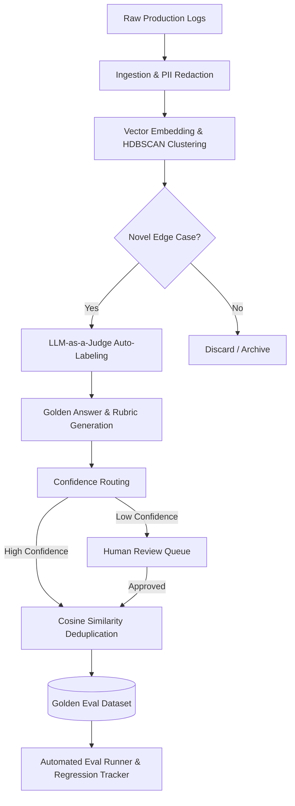

# 🧪 Automated Eval Dataset Generator

> **A self-healing, human-in-the-loop ML pipeline that turns raw production LLM logs into a curated, continuously growing golden evaluation dataset.**

Building an eval harness is easy; building a high-quality eval dataset is hard. Most AI teams rely on hand-curated golden sets that go stale as user behavior shifts. This project solves the data supply problem by automatically mining production traffic, clustering novel interactions, auto-labeling them using LLM-as-a-judge, and rigorously verifying them through a human-in-the-loop curation dashboard.

## 🏗️ Architecture & Pipeline



## ✨ Key Features

*   **Signal-Boosted Sampling**: Prioritizes production logs with high latency, negative user feedback (thumbs down), or retry behavior.
*   **Unsupervised Anomaly Detection**: Uses `sentence-transformers` and `HDBSCAN` to cluster interaction types and isolate previously unseen edge cases (prompt injections, policy questions, angry users).
*   **Rich Auto-Labeling**: Uses OpenRouter (Nemotron/GPT-4 class models) to automatically generate categorical labels, quality scores, expected behaviors, and `must_contain` / `must_not_contain` assertions.
*   **Confidence Routing**: Runs multi-pass evaluations. High-agreement labels are auto-approved; low-agreement labels are routed to a human review queue.
*   **Coverage-Driven Generation**: Continuously monitors dataset balance. If a category (e.g., Jailbreaks) falls below a threshold, the system synthesizes targeted logs to fill the gap.
*   **Regression Eval Runner**: Automatically tests new models against the curated dataset, generating pass/fail reports and flagging new regressions across specific categories.
*   **Streamlit Curation Dashboard**: A complete human-in-the-loop UI for dataset exploration, metric tracking, and single-click approval/rejection of queued auto-labels.

## 🛠️ Tech Stack

*   **Pipeline & Logic**: Python 3.11+, APScheduler, Pandas
*   **Embeddings & ML**: `sentence-transformers` (`all-MiniLM-L6-v2`), `scikit-learn`, `hdbscan`
*   **LLM Inference**: OpenRouter API (Fallback: Local Ollama)
*   **Database**: SQLite (Optimized for local, low-RAM environments)
*   **UI/Dashboard**: Streamlit

## 🚀 How to Run (Local Environment)

Designed to run entirely locally without Docker to conserve RAM.

1. **Install dependencies**:
   ```bash
   pip install -r requirements.txt
   ```

2. **Set your OpenRouter API Key**:
   ```bash
   # Windows PowerShell
   $env:OPENROUTER_API_KEY="your-api-key"
   ```

3. **Start the Autonomous Pipeline**:
   This runs the ingestion, clustering, self-healing, and deduplication loops in the background.
   ```bash
   python pipeline_scheduler.py
   ```

4. **Launch the Curation Dashboard**:
   ```bash
   streamlit run dashboard.py
   ```

## 🧠 Why This Matters (For AI Engineering)
A robust AI product needs continuous evaluation. By treating production traffic as a raw asset and using smaller, faster models to auto-curate it, we create a **flywheel effect**: the more the product is used, the more robust the evaluation suite becomes, allowing for faster and safer model iteration.
